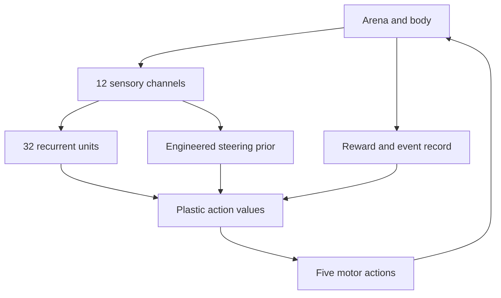

# Architecture

The simulator is independent of the user interface. The browser and command-line runner import the same modules, so the reference results do not depend on animation speed or screen dimensions.

| Module | Owns | Does not own |
| --- | --- | --- |
| `arena.js` | Bounds, targets, obstacles, idealised odour field | Learning |
| `sensors.js` | A 12-number observation | Drawing |
| `controller.js` | Recurrence, action values, prior, learning | Arena coordinates |
| `simulation.js` | Event order, body motion, rewards, interventions | DOM state |
| `metrics.js` | Derived measurements | Controller decisions |
| `experiments/runner.js` | Scheduled protocol execution | Browser timing |
| `src/ui` | Controls, canvases, local downloads | A separate simulation model |
| `extensions/market` | Alternate observations, paper environment | Real exchange execution |

`Simulation.step()` is the clock. One step corresponds to 100 ms of simulated time. The browser accumulates wall-clock time and asks for a whole number of steps; the CLI runs the same steps directly.

Each run has two independently seeded PRNG instances: one initialises the body heading, and the controller's PRNG initialises its matrices and selects exploratory actions. No dynamics use `Math.random()` or the wall clock.

The self-contained HTML is built by a small repository-specific bundler that follows named imports, preserves module scopes, and embeds reference JSON. It does not minify or hide the implementation. Source modules remain the editing surface.
